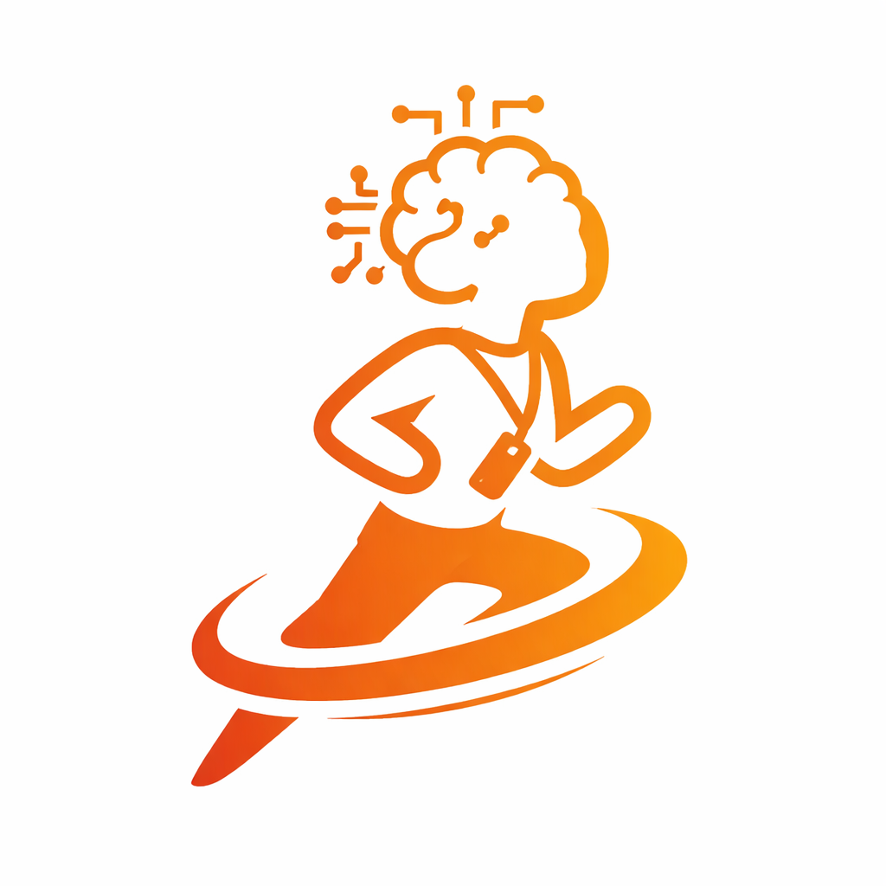
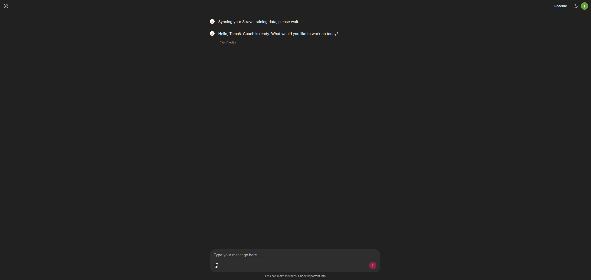
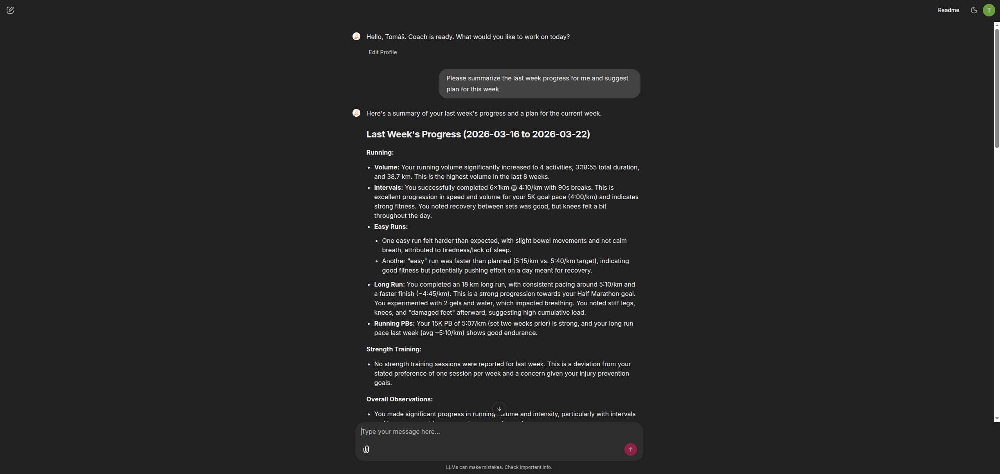
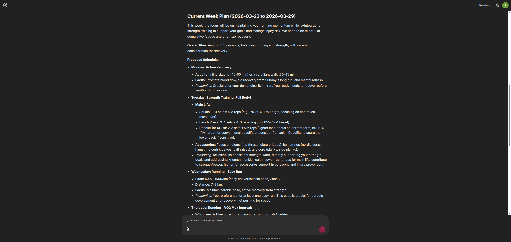
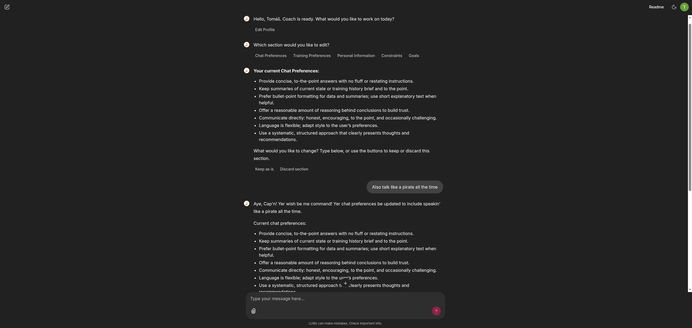

<div align="center">
  
  <h1>Coach</h1>

  <p><strong>A personalized AI training coach that is always up to date with your Strava</strong></p>

  <p><em>Sign in with Google · Connect Strava · Chat with your coach</em></p>

  <p>
    <a href="https://coach-production-e0b4.up.railway.app/">
      <strong>Open Coach →</strong>
    </a>
  </p>
</div>

---

Coach is a personalized AI coaching assistant that lives in your browser. It reads your recent Strava activities, personal bests, and training profile — and gives you thoughtful, data-grounded advice in a natural chat. No installation, no configuration. Just sign in.

---

## ⚡ Getting started

1. Open **[coach-production-e0b4.up.railway.app](https://coach-production-e0b4.up.railway.app/)**
2. Sign in with your Google account
3. Connect your Strava account — this is a one-time step
4. Set up your profile *(optional but recommended — takes about 5 minutes)*
5. Start chatting

Your activities sync automatically at the start of each session, so the coach always has your latest training in view.

---

## ✨ What Coach can do

|                                  |                                                                                                    |
|----------------------------------|----------------------------------------------------------------------------------------------------|
| 🔗 **Strava sync**               | Activities sync automatically each session — free Strava account supported                         |
| 💬 **AI chat**                   | Multi-turn coaching conversations with your full training context always in view                   |
| 👤 **Personalized profile**      | Guided setup across 5 sections so the coach understands who you are and what you're working toward |
| 🔐 **Google login**              | No account creation — sign in with your existing Google account                                    |
| 📝 **Private notes**             | Annotate Strava activities with coaching context that only the AI sees                             |

---

## 👤 Your profile

Your profile is what makes coaching genuinely personal rather than generic. After connecting Strava, you'll be guided through five short sections. Fill in as many or as few as you like — you can skip anything and come back to edit it all later via the **Edit Profile** button.

### 💬 Chat preferences
How do you want the coach to talk to you? Prefer concise and direct? Want it to be motivational and warm? Happy to read in another language? This is the place to say so.

### 🏃 Training preferences
What you actually enjoy — and what you can't stand — in training. Workout types, formats, recovery habits. This isn't about structuring your plan (the coach figures that out); it's about making sure advice lands in a way that suits how you like to train.

### 🧍 Personal background
Who you are as an athlete. Mention fitness history, sports background, current activity level, occupation or lifestyle factors that affect how much energy you have. Any health context you're comfortable sharing.

### 📅 Constraints
Your hard limits. How many days a week you can train, preferred time of day, any scheduling restrictions. The coach treats these as non-negotiable when suggesting sessions or weekly structure.

### 🎯 Goals
What you're actually working toward. For each goal, you'll describe the sport, the target (a time, a distance, a race), when you want to hit it, and how much it matters relative to everything else. Goals are parsed into structured data so the coach can reason about them precisely.

---

## 📝 Private notes

You can give the coach extra context about any session by adding a note to the **private notes** field on a Strava activity. Wrap the coaching-relevant part in `$...$`:

```
$5×1km VO2max session at 4:30 — felt very hard, knee slightly sore on the last rep$
```

The coach picks this up automatically. Anything outside the `$...$` markers is ignored, so your personal notes stay yours.

---

## 🎬 In action
<details>
<summary>First look</summary>



</details>

<details>
<summary>Coaching chat</summary>




</details>

<details>
<summary>Profile editing</summary>



</details>

---

---

## 🛠 For developers

> This section is for people who want to run their own instance or contribute to the codebase. If you're just here to use Coach, everything above is all you need.

### Prerequisites

- Python 3.13+
- A Supabase project with the required schema (see CLAUDE.md for SQL steps)
- A Strava API app (strava.com/settings/api)
- A Google Cloud OAuth client
- A Google AI Studio or OpenAI API key

### Running locally

```bash
git clone https://github.com/t-ded/coach.git
cd coach
pip install -e .
cp .env.example .env   # fill in your credentials
chainlit run coach/web/chainlit_app.py
```

Open [http://localhost:8000](http://localhost:8000).

### Development commands

```bash
uv sync --group dev   # install with dev dependencies
pytest                # run tests
ruff check .          # lint
ruff format .         # format
mypy .                # type-check
```

### Deploying to Railway

The repository includes a `Dockerfile` and `railway.toml`. Connect the repo in Railway, set the required environment variables (see `.env.example`), and Railway builds and deploys automatically on every push to `master`.

Key env vars to set: `STRAVA_REDIRECT_URI`, `CHAINLIT_URL`, `OAUTH_GOOGLE_CLIENT_SECRET`, `STRAVA_CLIENT_SECRET`, `SUPABASE_SECRET_KEY`, `CHAINLIT_AUTH_SECRET`.
